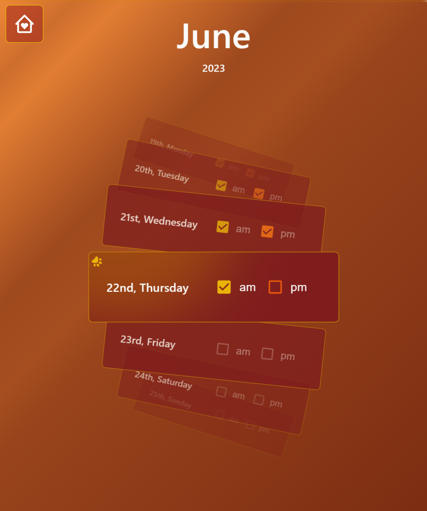

# KibbleCheck

## Simplifying Your Dog's Meal Schedule

Welcome to KibbleCheck, a unique Progressive Web App (PWA) designed to streamline your dog's meal schedule. The purpose of this app is to take the uncertainty and worry out of your pet's feeding schedule, making sure your dog gets their meals consistently and promptly, every single time. Say goodbye to overfeeding and missed meals!

## Features

### Intuitive User Interface

The custom calendar rolodex component is designed with simplicity in mind. Scroll to any day and check a box for AM and PM meals. Each checked checkbox signifies a meal that's been served, providing you with peace of mind and a consistent feeding routine for your pet.

### Collaborative Feeding (Coming Soon)

In the works is a feature that will allow multiple users to access and update your dog's meal calendar. Whether it's a spouse, dog walker, neighbor, or a family member, anyone assisting with feeding duties can easily mark when they've fed your furry friend. This eliminates the need for guesswork or waking up your partner to ask if the dog was fed.

## Technology Stack

KibbleCheck is built with a robust and modern technology stack:

###### Build & Package Management

###### Frontend

###### Backend

This combination of technologies creates a sleek, intuitive, and responsive application.

## Community

Come chat on Discord! This is the perfect place to ask questions, share feedback, or simply connect with other KibbleCheck users. Click [here](https://discord.gg/zGbx9x6YWw) to join the KibbleCheck Discord channel.

## Welcome to Stress-Free Pet Care

Now you'll never have to wonder if your dog has been fed. [KibbleCheck](https://kibblecheck.com/) is here to eliminate confusion around mealtimes. Join the family, and let's make pet care just a little easier, one meal at a time.
